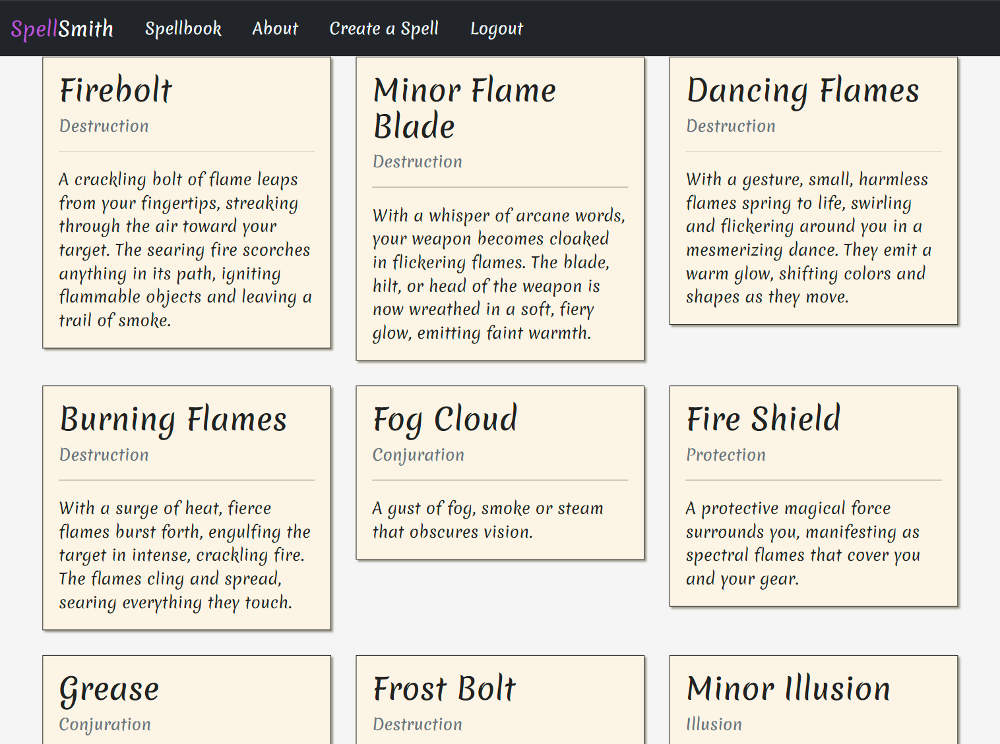

# SpellSmith

Add a Blurb about the site here, what does it do, why did you build it?

SpellSmith is an innovative online platform designed to help fantasy role-playing game DC20 players create their own magical spells. This interactive tool allows users to explore and understand various spells from the system, create their own and share their creations with the community. 

I built this website as a way to create and share creations among the DC20 community and to allow them to easily share their own creations, and act as a central reposity of up to date homebrew creations. Making cloud based applications for boardgames and tabletoip games is an area im very much intrested in going into in my career.

Whether you're a seasoned Dungeon Master looking for new spells for your campaigns, a player referring to one of the spells or a homebrewer looking to create new spells for the growing DC20 system. SpellSmith offers a unique resource for exploring the world of fantasy spells.

[View SpellSmith on Heroku here](https://spellsmith-9d992f394814.herokuapp.com/)

---

## CONTENTS

* [User Experience](#user-experience-ux)
  * [User Stories](#user-stories)

* [Design](#design)
  * [Colour Scheme](#colour-scheme)
  * [Typography](#typography)
  * [Imagery](#imagery)
  * [Wireframes](#wireframes)

* [Features](#features)
  * [General Features on Each Page](#general-features-on-each-page)
  * [Future Implementations](#future-implementations)
  * [Accessibility](#accessibility)

* [Technologies Used](#technologies-used)
  * [Languages Used](#languages-used)
  * [Frameworks, Libraries & Programs Used](#frameworks-libraries--programs-used)

* [Deployment & Local Development](#deployment--local-development)
  * [Deployment](#deployment)
  * [Local Development](#local-development)
    * [How to Fork](#how-to-fork)
    * [How to Clone](#how-to-clone)

* [Testing](#testing)

* [Credits](#credits)
  * [Code Used](#code-used)
  * [Content](#content)
  * [Media](#media)
  * [Acknowledgments](#acknowledgments)

---

## User Experience (UX)

DC20 is a fantasy roleplaying stsem currently being developed by the Dungeon Coach, a prominet conetnt creator in the TTRPG space, SpellSmith is a online repository of fan created spells, sharing ideas in the community. Users create a spell using the 'Create a Spell' page and can then update the spells they have created.

Key Features
  * Comprehensive Spell Database: Explore a wide range of spells across different schools of magic, including Conjuration, Destruction, Illusion, and Protection.
  * Detailed Spell Descriptions: Each spell comes with a vivid description, explaining its effects, usage, and potential outcomes.
  * Visual Representation: Spells are presented in the same format as the DC20 spellbook for a consistent experence.
  * User authentication: Powered by AllAuth, Users can create accounts, recover their accounts and use the account validation to edit or delete their homebrew spells. 

### User Stories

[User Stores for development can be found here:](https://github.com/users/LaurieAnderson92/projects/5/views/1)

#### Client Goals
* To be able to view the site on a range of device sizes.
* To make it easy for potential contributors to access and add to the repository.
* To allow people to join the DC20 community on discord
#### Viewer Goals
* I want to view spells that the community has created
* I want to be able to find more information about DC20
#### Contributor Goals
* I want to be able to easily make spells
* I want to be able to share the spells I make with the community via a link so others can see them.

## Design
### Colour Scheme

#### F7F7F7 | Seasalt 
* I used Seasalt as a offwhite colour as the background for the page, as #FFFFFF has a very sterile and clinical feel to it, and this muted white makes the other is softer and draws the eye to the Steel Pink or Purple

#### ba55d3 | Cosmic Latte
* Cosmic Lattee was picked as it is the closest colour that resembled parchment but still has a soft colour for a nice contrast with the default text colour and the colour when the text is highlighted

#### #ce5fea | Heliotrope
* Heliotrope is the same as Purple, but a few shades lighter with more green. I picked this colour as the highlighted text for the nav bar and the footer to better contast with the dark background for ally reasions

#### 222222 | Purple
* Purple was picked as the key accent colour as it is the same shade of purple that DC20 uses, and so creates a association between SpellSmith and DC20 in the vewers mind.

#### 800080 | Eerie Black
* Eerie black is a off black, and was chosen for the same reason as Seasalt, to mimic graphite or ink on parchment rather than the dark black associated with computer text.

### Typography

I chose to use the Merienda font from [Google Fonts](https://fonts.google.com/) to look like writing within a spellbook. Merienda has soft shapes, is slightly condensed, and has a rhythm which is an invitation to read short pieces of text.

### Wireframes

### ERD

| Field |Description|
|-------|-----------|
|creator|This is a FK for the django's User model, one to many relationship (one user can create many spells) If the user is deleted, the spells remain. This isn't populated on the Create a Spell form|
|name|This is the name of the spell, Max Character 255, required|
|excerpt|This is a flavourful description of the spell that appears on the list view and the detail view|
|school|this is a interger field, min 0 max 11, they corrolate to the SCHOOL array of tuples that list a school, every spell has a school and this list canot be added to by users for gameplay reasons. on the form is is adropdown select button|
|ap_cost|This is a interger field, min 1 max 4 and denotes how many action points it takes to cast the spell, required|
|mp_cost|This is a interger field, min 0 max 9 and denotes how many mana points it takes to cast the spell, of 0 then the spell is specififed as a cantrip in the spell detail, required|
|range|This is a text field, usually the range is either 'Self' or 10 Spaces but there are edge cases in the published spells, so free text seemed best, required|
|duration|This is a text field, usually the distance is either 'X Spaces' but there are edge cases in the published spells, so free text seemed best, required|
|concentration|This is Boolean field, if ticked then the requirement will appear on the spell.|
|description|This is a big text field where the details of the spell need to go, This field needs to be unique to prevent duplicates, required|
|ap_enhancements|This is a Big text field, Currently spells either have ap enhancements or mp enhancements, but I wanted to leave the posability for both to be present, or neither for flexability in homebre creation|
|mp_enhancements|This is a Big text field, Currently spells either have ap enhancements or mp enhancements, but I wanted to leave the posability for both to be present, or neither for flexability in homebre creation|

## Features

The website is comprised of a home page, and about page, a spell detail page and a create a spell page alongside the AllAuth Pages.

All pages on the website are responsive and have:

* A favicon in the browser tab.  

* A navigation bar alonside a text based logo, which also acts as a link to the homepage as per convention.  
 

 * Highlighted links with a onbrand purple colour.  
 

#### The Home Page
  
The homepage of the SpellSmith website displays the list of spells that the community has created, alongside the spells that the Dungeon Coach has officially released, it's paginated to display 12 spells at a time.

#### Spell Detail Page

Clicking on a spell detail page will display all of the mecanics of the spell, in the style similar to the DC20 spellblock in the free rules pdf.

#### Create a Spell Page

Clicking The create a spell link will take you to a form with a POST method to the SQL Database; The form has Validation on the required fields that ensure the user is inputting data correctly into the database

### Future Implementations

A list all future implementations can be found [here](https://github.com/users/LaurieAnderson92/projects/6/settings)  

Currently what I'd like to add are 

#35
#36
#37

### Accessibility

I have been mindful during coding to ensure that the website is as accessible as possible. This has been achieved by:

* Using semantic HTML.
* Using a hover state on all buttons on the site to make it clear to the user if they are hovering over a button.
* All Icons have aria labels so that they can be used by screen readers
* The colour pallate works for users with achromatic vision as can be demonstrated [here](https://coolors.co/f7f7f7-fcf5e5-ba55d3-800080-222222)

## Technologies Used

### Languages Used

HTML, CSS, Python

### Frameworks, Libraries & Programs Used

Add any frameworks, libraries or programs used while creating your project.

Make sure to include things like git, GitHub, the program used to make your wireframes, any programs used to compress your images, did you use a CSS framework like Bootstrap? If so add it here (add the version used).

A great tip for this section is to include them as you use them, that way you won't forget what you ended up using when you get to the end of your project.

#### Programs
* [Git](https://git-scm.com/) - For version control.
* [Github](https://github.com/) - To save and store the files in a could based repository.
* [GitPod](https://www.gitpod.io/) - IDE used to create the site, access provided by CI.
* [Favicon.io](https://favicon.io/) -  To find and create a favicon.
* [Phind](https://www.phind.com/search?home=true) - A AI based search engine to help me troubleshoot problems.
* [Balsamiq](https://balsamiq.com/) - Used to create the wireframe.
* [Greenshot](https://getgreenshot.org/) - Used to take Screenshots.
* [Heroku](https://dashboard.heroku.com/apps) - Used to deploy and host the site

#### Frameworks

* [Django](https://www.djangoproject.com/) - The core frameowrk to make a data driven website.
* [AllAuth](https://docs.allauth.org/en/latest/) - To provide the basic functionality for logging in, creating a user account and resetting a password.
* [Crispy forms](https://django-crispy-forms.readthedocs.io/en/latest/) - To create a form capable of Posting to the database with defensive coding in CSRF tokens and future proofing if the database location changes.
* [Gunicorn](https://gunicorn.org/) - Used to assist with a secure deployment in Heroku
* [PostgreSQL](https://www.postgresql.org/) - Database methoodology supplied by CI

#### Libaries
* [Google Fonts](https://fonts.google.com/)- To import the font used on the website.
* [Bootraps5](https://getbootstrap.com/docs/5.0/getting-started/introduction/) - provided the scalability and responsiveness design

## Deployment & Local Development

### Deployment

Heroku was used to deploy the live website. The instructions to achieve this are below:

* Go to Github.
* Find the repository for this project and create a fork [here](https://github.com/LaurieAnderson92/Spellsmith)
* Login or sign up to Heroku
* Click **New** > **Create New App**
* Choose the app name and Region and click 'Create App'
* Go to the 'Deploy' tab
* Link up the forked github repoitory with the heroku app
* Click **Deploy**

### Local Development

#### How to Fork

* Log in (or sign up) to Github.
* Find the repository for this project [here](https://github.com/LaurieAnderson92/Spellsmith)
* Click the **Fork** button in the top right corner.

#### How to Clone

* Log in (or sign up) to GitHub.
* Find the repository for this project [here](https://github.com/LaurieAnderson92/Spellsmith)
* Click on the code button, select whether you would like to clone with HTTPS, SSH or GitHub CLI and copy the link shown.
* Open the terminal in your code editor and change the current working directory to the location you want to use for the cloned directory.
* Type 'git clone' into the terminal and then paste the link you copied in step 3. 
* Press enter.

## Testing

Issues that required me to stop and think and research the awnser were listed as BUGS which Can be found [here](https://github.com/users/LaurieAnderson92/projects/4/views/1?filterQuery=Bug)

## Credits

👩🏻‍💻 View an example of a completed Credits section [here](https://github.com/kera-cudmore/BookWorm#Credits)

The Credits section is where you can credit all the people and sources you used throughout your project.

### Code Used

If you have used some code in your project that you didn't write, this is the place to make note of it. Credit the author of the code and if possible a link to where you found the code. You could also add in a brief description of what the code does, or what you are using it for here.

### Content

Who wrote the content for the website? Was it yourself - or have you made the site for someone and they specified what the site was to say? This is the best place to put this information.

###  Media

If you have used any media on your site (images, audio, video etc) you can credit them here. I like to link back to the source where I found the media, and include where on the site the image is used.
  
###  Acknowledgments

If someone helped you out during your project, you can acknowledge them here! For example someone may have taken the time to help you on slack with a problem. Pop a little thank you here with a note of what they helped you with (I like to try and link back to their GitHub or Linked In account too). This is also a great place to thank your mentor and tutor support if you used them.