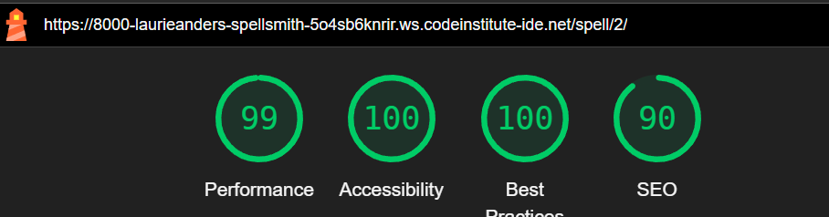

SpellSmith -  Testing

Visit the deployed site: [SpellSmith](https://spellsmith-9d992f394814.herokuapp.com/)

- - -

## CONTENTS

* [AUTOMATED TESTING](#automated-testing)
  * [W3C Validator](#w3c-validator)
  * [PEP8 Validator](#javascript-validator)
  * [Lighthouse](#lighthouse)
* [MANUAL TESTING](#manual-testing)
  * [Testing User Stories](#testing-user-stories)
  * [Full Testing](#full-testing)

Testing was ongoing throughout the entire SpellSmith project. Chrome developer tools were utilized while building to troubleshoot any issues I discovered.

During development I used google developer tools to ensure everything was working correctly and to assist with troubleshooting when things were not working as expected.

I utilised the search engine Phind when I encountered an issue That id didn't know the anwer too, or could not find the awnser in when reviewing the CI lessons. I also looked on Stack Overflow to help resolve any issues with Django 5.1.1 and Bootstraps5

I have run each page through Chrome developer tools to check and confirm that each page is responsive on a variety of different screen sizes.

- - -

## AUTOMATED TESTING

### W3C Validator

[W3C](https://validator.w3.org/) was used to validate the HTML on all pages of the website. It was also used to validate the CSS.

* [Spellbook](assets/testing/w3/w3_spellbook.png) - Passed
* [About](assets/testing/w3/w3_spellbook.png) - Passed, no errors found.
* [Create a Spell](assets/testing/w3/w3_create_a_spell.png) - Passed, no errors found.
* [Spell View](assets/testing/w3/w3_spelldetail.png) - Passed.

* [style.css](assets/testing/w3/w3_stylecss.png) - Passed, no errors found.

- - -

### JavaScript Validator

[PEP8ci](https://pep8ci.herokuapp.com/#) was used to validate the Python.

* [spellbook/views.py](assets/testing/pep8/pep8_sb_views.png) - E501 on Line 70, left because could not break up the link; future fix is to use a variable.
* [spellbook/urls.py](assets/testing/pep8/pep8_sb_urls.png) - Passed.
* [spellbook/models.py](assets/testing/pep8/pep8_sb_models.png) - Passed.
* [spellbook/forms.py](assets/testing/pep8/pep8_sb_forms.png) 4 E231 errors that do not refer to anything in the code

- - -

### Lighthouse

I used Lighthouse within the Chrome Developer Tools to test the performance, accessibility, best practices and SEO of the website. All pages have 100% accessability.

- - -

## MANUAL TESTING

### Testing User Stories

`Site Owner`

| Goals | How are they achieved? |
| :--- | :--- |
| As the Site Owner I can create, read, update and delete all spells so that I can manage the site's content | SpellSmith has a hidden admin view that allows full CRUD for each spell entry and user. |

`Site User`

|  Goals | How are they achieved? |
| :--- | :--- |
| As a Site user, I can Create, view, modify and delete my inputs so that I can curate the homebrew spells I'm making | Users can view all spells, create new spells and update and delete the spells they have written |
|As a Site User, I can click on the About link so that I can read about the site.| The User has access to the about page where they can find out more information about DC20 and the Site, as well as social links where you'd expect on a site following convestion.|
| As a Site User I can See when I have completed an action so that I receive use feedback from the site. | SpellSmith has an alert system using django messaging to display feedback to the user, the create a spell form also has visual indication of what fields are requires and feedback validation. |
|As a Site User, I can create draft spells so that I can finish writing the content later | This is a Key Funtionality and was covered with the update part of CRUD, Future updates will expand on this.|

- - -

### Full Testing

Full testing was performed on the following devices:

* Desktop:
  * Homebuilt Rig
* Mobile Devices:
  * Samsung Galaxy S10+.

Each device tested the site using the following browsers:

* Google Chrome
* Firefox
* Google Chrome developer tools to adjust screen sizes.

Additional testing was taken by friends on a variety of devices and screen sizes. They reported no issues when navigating the site.

`All Pages`

| Feature | Expected Outcome | Testing Performed | Result | Pass/Fail |
| --- | --- | --- | --- | --- |
| The Site's title | Link directs the user back to the home page | Clicked title | Home page reloads | Pass |
| Navbar: Spellbook         | Link directs the user back to the home page | Clicked on Anchor 'Spellbook' | Browser navigates to homepage | Pass |
| Navbar: About             | Link directs the user to the about page | Clicked on Anchor 'About' | Browser navigates to About page | Pass |
| Navbar: Create a Spell    | Link directs the user to the form page | Clicked on Anchor 'create a spell' while logged in | Browser navigates to Create page | Pass |
| Navbar: Logout            | Link directs the user to the logout page | Clicked on Anchor 'Logout' while logged in | Browser navigates to logout page | Pass |
| Navbar: Register          | Link directs the user to the Register page | Clicked on Anchor 'Register' while logged out | Browser navigates to register page | Pass |
| Navbar: Login             | Link directs the user to the login page | Clicked on Anchor 'Login' while logged out | Browser navigates to loh page | Pass |
| Footer: social links      | Social buttons direct to matching socials in new tab | Clicked on social anchours | Opens the correct social page in a new tab | Pass |

`Spellbook page`

| Feature | Expected Outcome | Testing Performed | Result | Pass/Fail |
| --- | --- | --- | --- | --- |
| Spell cards linked | Link directs the user to the associated spell's detail view | Clicked spell card | Directed to correct spell | Pass |
| All cards - hover effect | All text on the cards should turn purple on hover  | Hover over each card on the page | Each card displayed the correct styling when hovered over | Pass |
| Pagnaite the view | The user should be able to click next and previous if there are more than 12 spells | create 13 spells and move back and forth between the pages | Next and Prev Buttons appear | Pass |

`Spell Detail page`

| Feature | Expected Outcome | Testing Performed | Result | Pass/Fail |
| --- | --- | --- | --- | --- |
| DC20 spell format | The view should display all of the fields from the spell model | viewed spell | All fields present, but formatting on the text fields not present | Partial Pass : [Bug Raised](https://github.com/LaurieAnderson92/Spellsmith/issues/38) |
| Buttons not visible unless logged in | The view shouldn't display the delete or edit buttons unless the user is logged in and they are viewing a spell they created | viewed spell while logged out | Buttons not present | Pass |
| Deleting a Spell | The spell creator should be able to delete a spell via the button | deleted a spell | Spell no longer exists, warning message was displayed first | Pass |
| Editing a Spell | The spell creator should be able to edit a spell via the button | edited a spell | a instance of create a spell was opened with data populated, when submitted the spell was edited | Pass |

`Create a Spell page`
| Feature | Expected Outcome | Testing Performed | Result | Pass/Fail |
| --- | --- | --- | --- | --- |
| Creating a Spell | The user should be able to create a spell via the form | created a spell | Spell now exists | Pass |
| Buttons not visible unless logged in | The view shouldn't display the delete or edit buttons unless the user is logged in and they are viewing a spell they created | viewed spell while logged out | Buttons not present | Pass |
| Form validation | The form shouldn't submit if the field data is incorect and should guide the user to what needs to be chnaged | Tried to create a spell with invalid data | form not submitted, feedback presented | Pass |

`Login`

| Feature | Expected Outcome | Testing Performed | Result | Pass/Fail |
| --- | --- | --- | --- | --- |
| Create a User | Able to create a user | followed instructions to create a user | User was created | Pass |
| Login as a user | Able to login | followed instructions to login | User was authenticed | Pass |
| Logout as a user | Able to logout | followed instructions to logout | User was signed out | Pass |